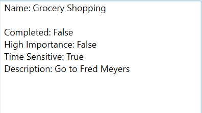
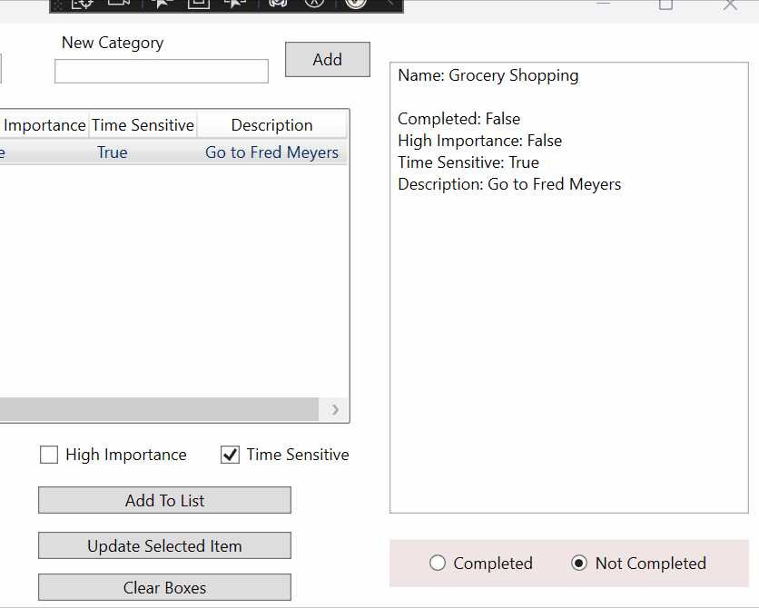

# Prog_2_FinalReview


## Knowledge Need

All Controls
    - Give names to reference in your C# code
    - Add events
    - Change Text ( replace and append )
    - Get values

- TextBox
- Label
- Button
- Rich Text Box ( Run specifically )
    - Give run a name
    - How to append text
    - How to replace text
- ListBox and ComboBox
    - Items Source
    - Selected Index
    - On Selection Change event
- Lists
    - Create and initialize in local and global scope
    - Add files
    - Access individual elements
- Classes
    - Create classes in their own files
    - Fields
    - Constructors
    - Properties
    - Methods
    - Object in objects
    - How to override to strings
    - Checking for null
- CheckBox and RadioButton
    - How to get and respond to the selected value
- ListView
    - Items Source
        - Change source on load, and while application is running
    - Selected Index
        - Check if item is selected ( index != -1 )
    - On Selection Change Event

---
## Layout


- Category change box
    - Combobox to hold category names
        - Has an on selection changed event
        - Displays todo items for category in listview
- Add New Category
    - Label, TextBox, Button
- Display ToDo Items
    - ListView
        - Has a selection changed event
        - Selected item information displays on rich text box to the right and text box info below.
- Task Name
    - Label, Textbox
- Description Box
    - Label
    - Rich Text Box
- High Importance
    - Check Box
- Time Sensitive
    - Check Box
- Complete and Not Completes
    - Radio Buttons, grouped together
- Add To List
    - Button
    - Event that adds new item to current category
- Update Selected Item
    - Button
    - Updates the currently selected item with the new information
- Clear Boxes
    - Clears all check boxes, text boxes, rich text boxes, sets the list view selection to -1, and sets radio button to not completed.
- Display Information
    - Rich Text Box

---

## Classes

### ***Item.cs***
The item class represents a single "To Do" list item.

- **Fields and Properties ( Gets and Sets for all )**

```csharp
    string _name;
    string _description;
    bool _highImportance;
    bool _timeSensitive;
    bool _isCompleted;
```

- **Constructor**
    - Takes arguments for 
        - Name
        - Description
        - High Importance
        - Time Sensitive
    - Sets `_isCompleted` to false

- **Methods**
    - `string DisplayInformation()`
        - Returns a string with the instanced Items information.

        Ex.


    - `void AssignmentCompleted()`
        - Assigns true to the `isCompleted` property
        - Appends "**Task Completed**" to the description

        Ex. 

---

### ***Category.cs***
Category represent a unique category item with it's own list of "To Do" items associated with it.

- **Fields and Properties ( getters and setters for both)**

```csharp
    string _name;
    List<Item> _todoItemsInCategory;
```

- **Constructor**
    - Create a constructor that takes a name
    - Initialize the List<Item> in your constructor

- **Methods**
    - `void AddItemToCategory(Item item)`
        - Pass an item in to add it to our category to do list
        - This replaces have the user have to do use `categoryName.TodoItemsInCategory.Add()`. It helps read ability and *abstracts* how our code works ( more on this in programming 3 ).
    - `override string ToString()`
        - Return the category name
        - This is used to easily display the category name to our combo box.

--- 

## MainWindow.xaml.cs

- Add Task ( Button Click Event )

- Update Take ( Button Click Event )

- Clear Boxes ( Button Click Event )

- Preload

- 